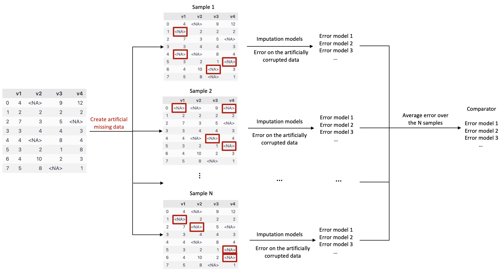

.. -*- mode: rst -*-

|GitHubActions|_ |ReadTheDocs|_ |License|_ |PythonVersion|_ |PyPi|_ |Release|_ |Commits|_

.. |GitHubActions| image:: https://github.com/Quantmetry/qolmat/actions/workflows/test.yml/badge.svg
.. _GitHubActions: https://github.com/Quantmetry/qolmat/actions

.. |ReadTheDocs| image:: https://readthedocs.org/projects/qolmat/badge
.. _ReadTheDocs: https://qolmat.readthedocs.io/en/latest

.. |License| image:: https://img.shields.io/github/license/Quantmetry/qolmat
.. _License: https://github.com/Quantmetry/qolmat/blob/dev_MLP/LICENSE

.. |PythonVersion| image:: https://img.shields.io/pypi/pyversions/qolmat
.. _PythonVersion: https://pypi.org/project/qolmat/

.. |PyPi| image:: https://img.shields.io/pypi/v/qolmat
.. _PyPi: https://pypi.org/project/qolmat/

.. |Release| image:: https://img.shields.io/github/v/release/Quantmetry/qolmat
.. _Release: https://github.com/Quantmetry/qolmat

.. |Commits| image:: https://img.shields.io/github/commits-since/Quantmetry/qolmat/latest/main
.. _Commits: https://github.com/Quantmetry/qolmat/commits/master

Welcome to Qolmat’s documentation!
###################################################

The Qolmat package is created for the implementation and comparison of imputation methods. It can be divided into two main parts:

1. Impute missing values via multiple algorithms;
2. Compare the imputation methods in a supervised manner.

********************************
 1 - Imputation methods
********************************

For univariate time series:

* **ImputerMean** / **ImputerMedian** / **ImputerMode** : Replaces missing entries with the mean, median or mode of each column. It uses ``pd.DataFrame.fillna()``.
* **ImputerSuffle** : Replaces missing entries with the random value of each column.
* **ImputerLOCF** / **ImputerNOCB** : Replaces missing entries by carrying the last observation forward/ next observation backward, for each columns.
* **ImputerInterpolation**: Replaces missing using some interpolation strategies supported by ``pd.Series.interpolate``.
* **ImputerResiduals**: Imputes values by a residuals methods. The series are de-seasonalised, residuals are imputed, then residuals are re-seasonalised.
* **ImputerRPCA**: Imputes values via a RPCA method.

For multivariate time series:

* **ImputerKNN** : Replaces missing entries with the k-nearest neighbors. It uses the ``sklearn.impute.KNNImputer``.
* **ImputerIterative** : Imputes each Series within a DataFrame multiple times using an iteration of fits and transformations to reach a stable state of imputation each time.It uses ``sklearn.impute.IterativeImputer``
* **ImputerMICE** : Imputes each Series within a DataFrame multiple times using an iteration of fits and transformations to reach a stable state of imputation each time. It uses ``sklearn.impute.IterativeImputer``.
* **ImputerRegressor**: It imputes each Series with missing value within a DataFrame using a regression model whose features are based on the complete ones only.
* **ImputeRPCA**: Imputes values via a RPCA method.
* **ImputerEM**: Imputation of missing values using a multivariate Gaussian model through EM optimization and using a projected (Ornstein-Uhlenbeck) process.

********************************
2 - Comparator
********************************

The **Comparator** class implements a way to compare multiple imputation methods.
It is based on the standard approach to select some observations, set their status to missing, and compare
their imputation with their true values.

More specifically, from the initial dataframe with missing value, we generate additional missing values (N samples/times).
Missing values can be generated following the MCAR mechanism.

* In the MCAR setting, each value is masked according to the realisation of a Bernoulli random variable with a fixed parameter.

On each sample, different imputation models are tested and reconstruction errors are computed on these artificially missing entries. Then the errors of each imputation model are averaged and we eventually obtained a unique error score per model. This procedure allows the comparison of different models on the same dataset.

********************************
3 - Installation
********************************

🔗 Requirements
===============

Python 3.8+

🛠 Installation
================

**Installation for conda user**
---------------------------------

.. code:: python

    cconda env create -f environment.dev.yml
    conda activate env_qolmat_dev

**Install pre-commit**
---------------------------------

Once the environment is installed, pre-commit is installed, but need to be activated using the following command:

.. code:: python

    pre-commit install

📝 Contributing
===============

This work is under development. And a lot of changes will still be made.

🔍  Further reading
===================
