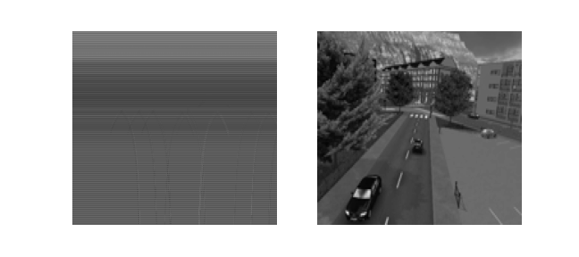
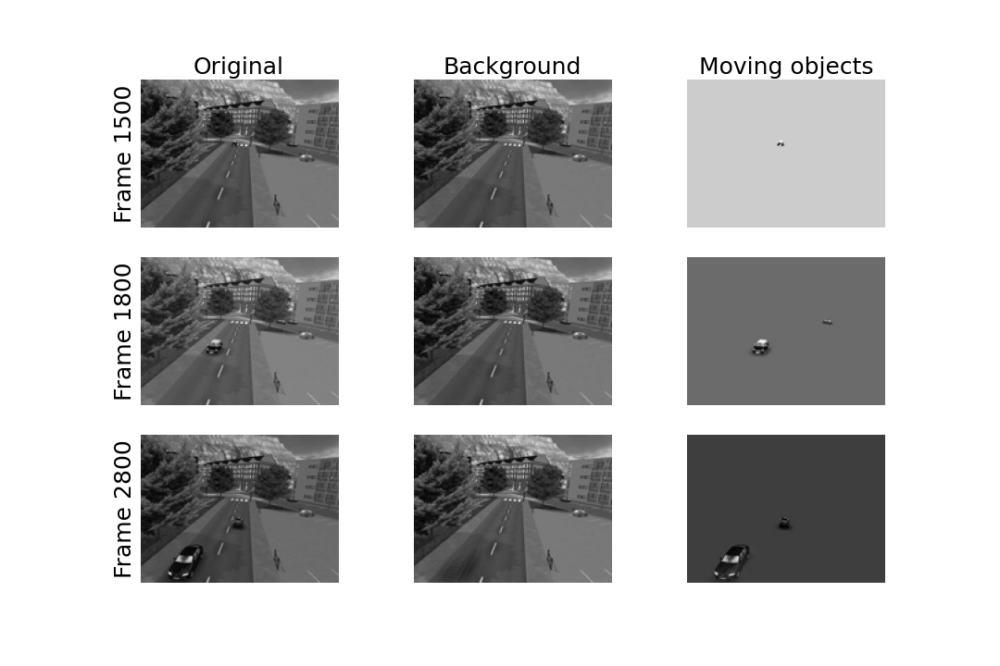

################################################################
Example for background and foreground separation with robust PCA 
################################################################

In this notebook, we'll see how to use RPCA algorithms to extract the background and foreground of a video. 

First, import some usefull libraries and functions

.. code-block:: python

    from robust_pca.utils import utils_images, drawing
    from robust_pca.classes.pcp_rpca import PcpRPCA

    import numpy as np
    %matplotlib inline
    import matplotlib.pyplot as plt
    import moviepy.editor as mpe
    import os

And then, we load the video.
however, the initial resolution is too heavy to deal with. 
So, we choose to rescale the images. 
In this way, an image from one moment in time is resized in 120 pixels by 160 pixels 
(with this particular video and with the scale 25).

.. code-block:: python

    video = mpe.VideoFileClip('../data/toy_video.mp4')
    scale = 25 
    dims = (int(480 * (scale/100)), int(640 * (scale/100)))

The idea is to transform a video into a matrix, for which it will be posible to differentiate 
the background from the foreground. To do so, we extract the images from the video every 
hundredths of a second; these images are rescaled and unfolded to form column-vectors of dimension (120×160,1). 
We then stack them all and eventually get a matrix of dimension (120×160,video.duration×100). 
This final matrix represents the video.
One sees horizontal lines and some curves. 
The latter are the anomalies to detect and represent the moving cars on a static background. 
To get an idea of one frame, we can reshape a column.

 .. code-block:: python

    M, dimension = utils_images.video2matrix(video, 100, scale)
    fig, ax = plt.subplots(1, 2, figsize=(9,4))
    ax[0].imshow(M, cmap="gray", aspect="auto")
    ax[1].imshow(np.reshape(M[:,2800], dims), cmap="gray", aspect="auto")
    for x in ax.ravel():
        x.axis("off")
    plt.show()
        

We now apply a RPCA algorithm. 

.. warning::
    This is a very slow process. See online formulation for some acceleration of the procedure.

Then, for a first glimpse, we select some frames (e.g. 1500th, 1800th and 2800th frames) 
to see how the RPCA has detected the moving objects. The moving cars are spotted as anomalies, 
and are correctly imputed: the background --low-rank part-- is correctly retrieved.

.. code-block:: python
    
    rpca = PcpRPCA().
    rpca.fit(D=M)
    drawing.plot_images(M, rpca.X, rpca.A, [1500, 1800, 2800], dimension) 

