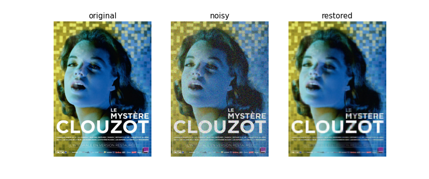

###########################################
Example for image denoising with robust PCA
###########################################

The aim of this notebook is to make use of the RPCA method to denoise an (artificially corrupted) image.

First, import some usefull libraries and functions

.. code-block:: python

    from robust_pca.utils import utils_images
    from robust_pca.classes.pcp_rpca import PcpRPCA

    import numpy as np
    import urllib.request
    %matplotlib inline
    import matplotlib.pyplot as plt
    import PIL.Image

We import an image that we convert to a numpy array (if needed, download an image).

.. code-block:: python

    url = "https://www.acaciasfilms.com/wp-content/uploads/2017/11/AF_Myste%CC%80reClouzot-1-800x1132.jpg"
    urllib.request.urlretrieve(url, "../data/clouzot.jpg")
    img = np.asarray(PIL.Image.open('../data/clouzot.jpg'), dtype=np.uint8)

We first choose the ratio :math:`ratio` of corrupted pixels, i.e. we want to artificially corrupt the image :math:`img`. 
Then, we apply a RPCA algorithm that spits the low-rank parts, 
which are concatenate to form an image.

.. note::
    In practice, :math:`ratio` % of pixels of each slice of the image are corrupted.  
    The function :class:`utils_images.corrupt_image` works on the three layers of the image. 
    This is why the RPCA algorithm is applied multiple times (i.e. hence the use of the loop).

.. code-block:: python

    %% time

    ratio  = 0.25
    noisy_image = utils_images.corrupt_image(img, ratio)

    res = []
    for i in range(noisy_image.shape[2]):
        rpca = RPCA()
        rpca.fit(D=noisy_image[:,:,i])
        res.append(rpca.X)
    restored_image = np.stack(res, axis=-1).astype(np.uint8)

    print(f"similarity score between the original and the noisy image: {utils_images.similarity_images(img, noisy_image)}")
    print(f"similarity score between the original and the restored image: {utils_images.similarity_images(img, restored_image)}")

.. code-block:: console

    similarity score between the original and the noisy image: 0.7369609061239467
    similarity score between the original and the restored image: 0.973397754266048
    CPU times: user 23min 10s, sys: 4min 32s, total: 27min 42s
    Wall time: 4min 26s   

Finally, one visually checks the scores obtained. 
There are of course some limitations with this method. 
For instance, one observes the letters are poorly recovered... 
However, without any training, it is possible to denoise, to some extent, a corrupted image.  

.. code-block:: python
    
    fig, ax = plt.subplots(1, 3, sharey=True, figsize=(4*3,5))
    suptitles = ["original", "noisy", "restored"]
    for j, (i,t) in enumerate(zip([img, noisy_image, restored_image], suptitles)):
        ax[j].imshow(i, aspect='auto')
        ax[j].set_title(t, fontsize=15)
        ax[j].axis("off")
    plt.show()

