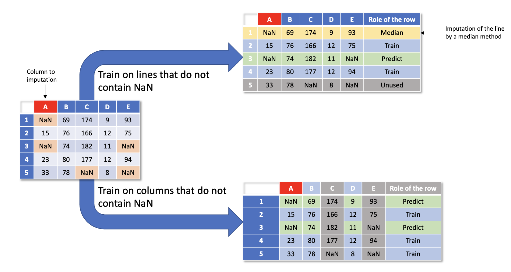
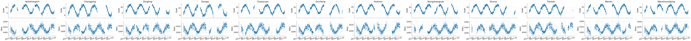
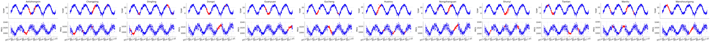
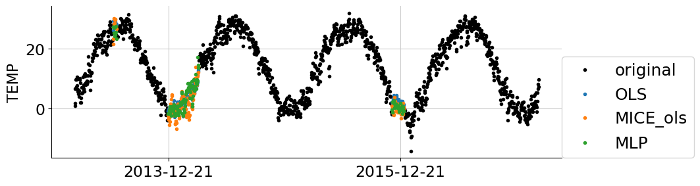
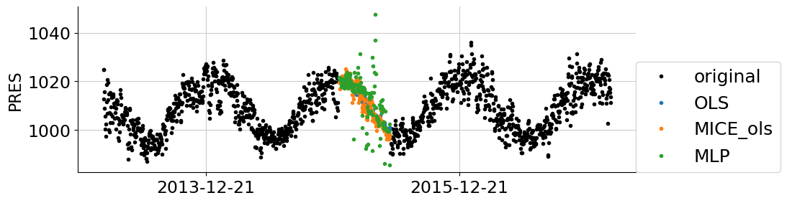

#########################
Imputation with keras
#########################

In this section, we present several approaches to do data imputation using Deep Learning methods:

- **Multi-Layers Perceptrons (MLP)**

- **Autoencoder**

To do this, we use Keras with the Tensorflow package, as with the following imports:

.. code-block:: python

    import warnings
    import pandas as pd
    import numpy as np
    import tensorflow as tf

    tab10 = plt.get_cmap("tab10")
    plt.rcParams.update({'font.size': 18})

    from matplotlib import pyplot as plt
    import matplotlib.ticker as plticker

    from sklearn.linear_model import LinearRegression

    from qolmat.benchmark import comparator, missing_patterns
    from qolmat.imputations import imputers
    from qolmat.imputations import imputers_keras
    from qolmat.utils import data, utils, plot

*********************
MLP Model
*********************

For the MLP model, we work on a dataset that corresponds to weather data with missing values. We add missing MCAR values on the features "TEMP", "PRES" and other features with NaN values. The goal is impute the missing values for the features "TEMP" and "PRES" by a Deep Learning method. We add features to take into account the seasonality of the data set and a feature for the station name

.. code-block:: python

    df = data.get_data("Beijing")
    cols_to_impute = ["TEMP", "PRES"]
    cols_with_nans = list(df.columns[df.isna().any()])
    df_data = data.add_datetime_features(df)
    df_data[cols_with_nans + cols_to_impute] = data.add_holes(pd.DataFrame(df_data[cols_with_nans + cols_to_impute]), ratio_masked=.1, mean_size=120)
    df_data.isna().sum()

There are two methods to train a Deep Learning model by removing missing data:

- **By line:** We impute the lines containing at least one missing value by a median method and we train the Deep Learning model only on the lines without any missing values. In this case, one must be careful to have enough data;

- **By column:** We remove the columns containing at least one missing value. And we train the Deep Learning model only on the columns without missing values. In this case, it is necessary to think about having at least one column because in the contrary case a median method will be applied.

In the dataset, we have few rows, so we will impute "PRES" and "TEMP" by a column method.
We can observe the missing data for the temperature and pressure data.

.. code-block:: python

    n_stations = len(df_data.groupby("station").size())
    n_cols = len(cols_to_impute)
    fig = plt.figure(figsize=(10 * n_stations, 3 * n_cols))
    for i_station, (station, df) in enumerate(df_data.groupby("station")):
        df_station = df_data.loc[station]
        for i_col, col in enumerate(cols_to_impute):
            fig.add_subplot(n_cols, n_stations, i_col * n_stations + i_station + 1)
            plt.plot(df_station[col], '.', label=station)
            # break
            plt.ylabel(col)
            plt.xticks(rotation=15)
            if i_col == 0:
                plt.title(station)
            if i_col != n_cols - 1:
                plt.xticks([], [])
    plt.show()

The documentation to build a Multi-Layers Perceptrons (MLP) with Keras is detailed on the link : https://www.tensorflow.org/guide/core/mlp_core

For the example, we use a simple MLP model with 2 layers of neurons.
Then we train the model without taking a group on the stations

.. code-block:: python
    
    estimator_mlp = tf.keras.models.Sequential([
    tf.keras.layers.Dense(128, activation='sigmoid'),
    tf.keras.layers.Dense(32, activation='sigmoid'),
    tf.keras.layers.Dense(1)])
    estimator_mlp.compile(optimizer='adam', loss='mae')
    imputer_mlp = imputers_keras.ImputerRegressorKeras(estimator=estimator_mlp, handler_nan = "column")

Training and imputation are done using **.fit_transform**.

.. code-block:: python
    
    df_plot = df_data
    df_imputed = imputer_mlp.fit_transform(df_plot)

We can compare on the figure below with in blue the real data and in red the missing data that have been imputed

************************
Autoencoder Imputation
************************

Coming Soon...

***************
Benchmark
***************

A benchmark on different imputer models is proposed for comparison.

.. code-block:: python

    imputer_mice_ols = imputers.ImputerMICE(groups=["station"], estimator=LinearRegression(), sample_posterior=False, max_iter=100, missing_values=np.nan)
    imputer_ols = imputers.ImputerRegressor(groups=["station"], estimator=LinearRegression())

    dict_imputers = {
        "OLS": imputer_ols,
        "MICE_ols": imputer_mice_ols,
        "MLP": imputer_mlp,
    }
    n_imputers = len(dict_imputers)
    ratio_masked = 0.1
    generator_holes = missing_patterns.EmpiricalHoleGenerator(n_splits=2, groups = ["station"], subset = cols_to_impute, ratio_masked=ratio_masked)

    comparison = comparator.Comparator(
        dict_imputers,
        df_data.columns,
        generator_holes = generator_holes,
        n_calls_opt=5,
    )
    results = comparison.compare(df_data)
    results

It is possible to change the value of **ratio_masked** which allows you to choose the proportion of values that you mask in order to compare the imputation methods. 
In **result**, you can find the different metrics for each imputation method. 

We can display the result of the different predictions

