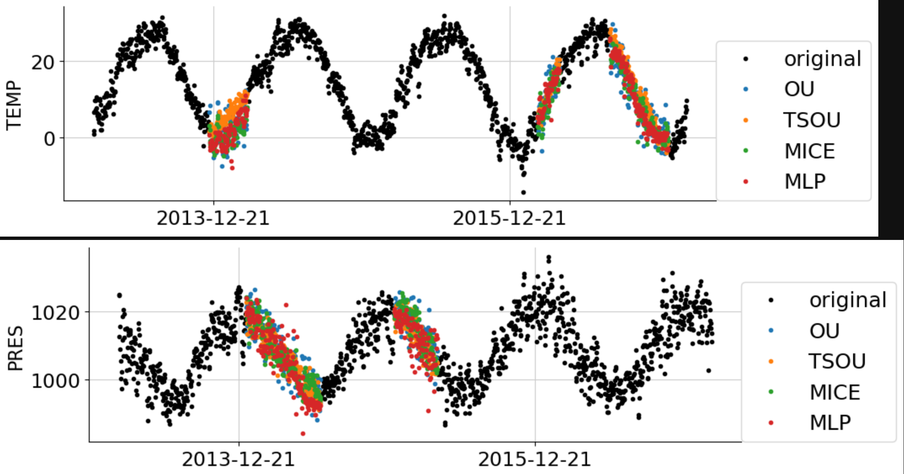

#########################
Imputation with keras
#########################

We will present an example of the use of a Multi-layer Perceptron imputer in several use cases.
are several strategies for imputing missing data when training a Multi-Layer Perceptron (MLP) model:

- **By line:** We impute the lines containing at least one missing value by a median method and we train the MLP model only on the lines without any missing values. In this case, one must be careful to have enough data;

- **By column:** We remove the columns containing at least one missing value. And we train the MLP model only on the columns without missing values. In this case, it is necessary to think about having at least one column because in the contrary case a median method will be applied.

.. code-block:: python

    import warnings
    import pandas as pd
    import numpy as np
    import tensorflow as tf

    tab10 = plt.get_cmap("tab10")
    plt.rcParams.update({'font.size': 18})

    from matplotlib import pyplot as plt
    import matplotlib.ticker as plticker

    from sklearn.linear_model import LinearRegression

    from qolmat.benchmark import comparator, missing_patterns
    from qolmat.imputations import imputers
    from qolmat.imputations import imputers_keras
    from qolmat.utils import data, utils, plot

We present the dataset to be imputed. This dataset corresponds to weather data with many missing values.
We add a feature to take into account the seasonality of the dataset

.. code-block:: python

    df = data.get_data("Beijing")
    cols_to_impute = ["TEMP", "PRES"]
    df_data = data.add_datetime_features(df)
    df_data[cols_to_impute] = data.add_holes(pd.DataFrame(df_data[cols_to_impute]), ratio_masked=.2, mean_size=120)
    df_data.isna().sum()

In the dataset, we have few rows, so we will impute by a column method.
We can observe the missing data for the temperature and pressure data.

.. code-block:: python

    n_stations = len(df_data.groupby("station").size())
    n_cols = len(cols_to_impute)
    fig = plt.figure(figsize=(10 * n_stations, 3 * n_cols))
    for i_station, (station, df) in enumerate(df_data.groupby("station")):
        df_station = df_data.loc[station]
        for i_col, col in enumerate(cols_to_impute):
            fig.add_subplot(n_cols, n_stations, i_col * n_stations + i_station + 1)
            plt.plot(df_station[col], '.', label=station)
            # break
            plt.ylabel(col)
            plt.xticks(rotation=15)
            if i_col == 0:
                plt.title(station)
            if i_col != n_cols - 1:
                plt.xticks([], [])
    plt.show()

A benchmark on different imputor models is proposed for comparison with the MLP.

.. code-block:: python

    imputer_ou = imputers.ImputerEM(groups=["station"], method="multinormal", strategy="ou", max_iter_em=34, n_iter_ou=15, dt=1e-3)
    imputer_tsou = imputers.ImputerEM(groups=["station"], method="VAR1", strategy="ou", max_iter_em=34, n_iter_ou=15, dt=1e-3)
    imputer_mice = imputers.ImputerMICE(groups=["station"], estimator=LinearRegression(), sample_posterior=False, max_iter=100, missing_values=np.nan)

    estimator = tf.keras.models.Sequential([
        tf.keras.layers.Dense(128, activation='relu'),
        tf.keras.layers.Dense(64, activation='relu'),
        tf.keras.layers.Dense(32, activation='relu'),
        tf.keras.layers.Dense(1)])
    estimator.compile(optimizer='adam', loss='mae', metrics=['mse'])
    imputer_mlp = imputers_keras.ImputerRegressorKeras(groups=["station"], estimator=estimator, handler_nan = "column")

    dict_imputers = {
        "OU": imputer_ou,
        "TSOU": imputer_tsou,
        "MICE": imputer_mice,
        "MLP": imputer_mlp,
    }
    n_imputers = len(dict_imputers)
    ratio_masked = 0.05
    generator_holes = missing_patterns.EmpiricalHoleGenerator(n_splits=2, subset = cols_to_impute, groups=["station"], ratio_masked=ratio_masked)

    comparison = comparator.Comparator(
        dict_imputers,
        df_data.columns,
        generator_holes = generator_holes,
        n_calls_opt=10,
    )
    results = comparison.compare(df_data)

It is possible to change the value of **ratio_masked** which allows you to choose the proportion of values that you mask in order to compare the imputation methods. 
In **result**, you can find the different metrics for each imputation method. 

We can display the result of the different predictions

.. code-block:: python

    df_plot = df_data
    dfs_imputed = {name: imp.fit_transform(df_plot) for name, imp in dict_imputers.items()}
    station = df_plot.index.get_level_values("station")[0]
    df_station = df_plot.loc[station]
    dfs_imputed_station = {name: df_plot.loc[station] for name, df_plot in dfs_imputed.items()}
    for col in cols_to_impute:
    fig, ax = plt.subplots(figsize=(10, 3))
    values_orig = df_station[col]

    plt.plot(values_orig, ".", color='black', label="original")

    for ind, (name, model) in enumerate(list(dict_imputers.items())):
        values_imp = dfs_imputed_station[name][col].copy()
        values_imp[values_orig.notna()] = np.nan
        plt.plot(values_imp, ".", color=tab10(ind), label=name, alpha=1)
    plt.ylabel(col, fontsize=16)
    plt.legend(loc=[1, 0], fontsize=18)
    loc = plticker.MultipleLocator(base=2*365)
    ax.xaxis.set_major_locator(loc)
    ax.tick_params(axis='both', which='major', labelsize=17)
    plt.show()

